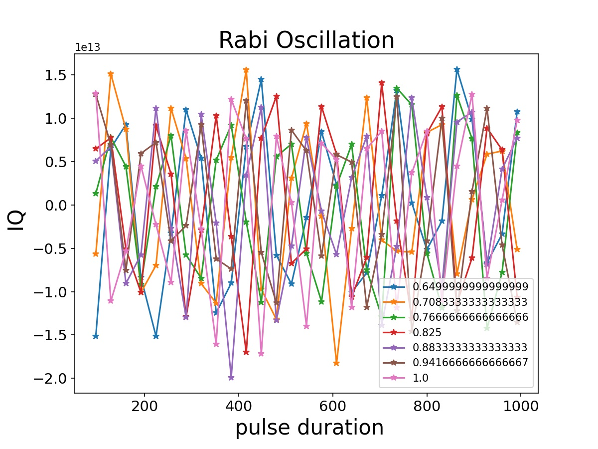
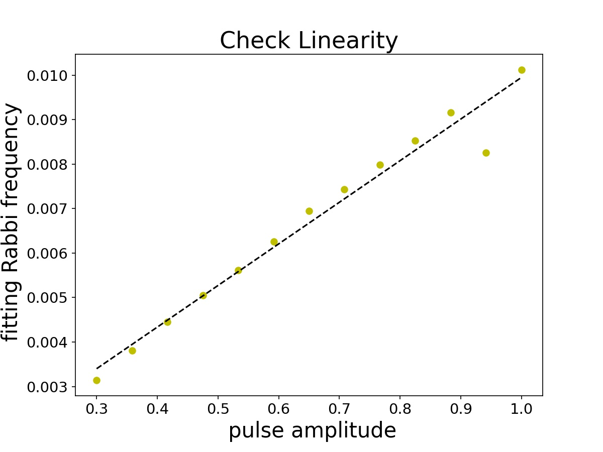
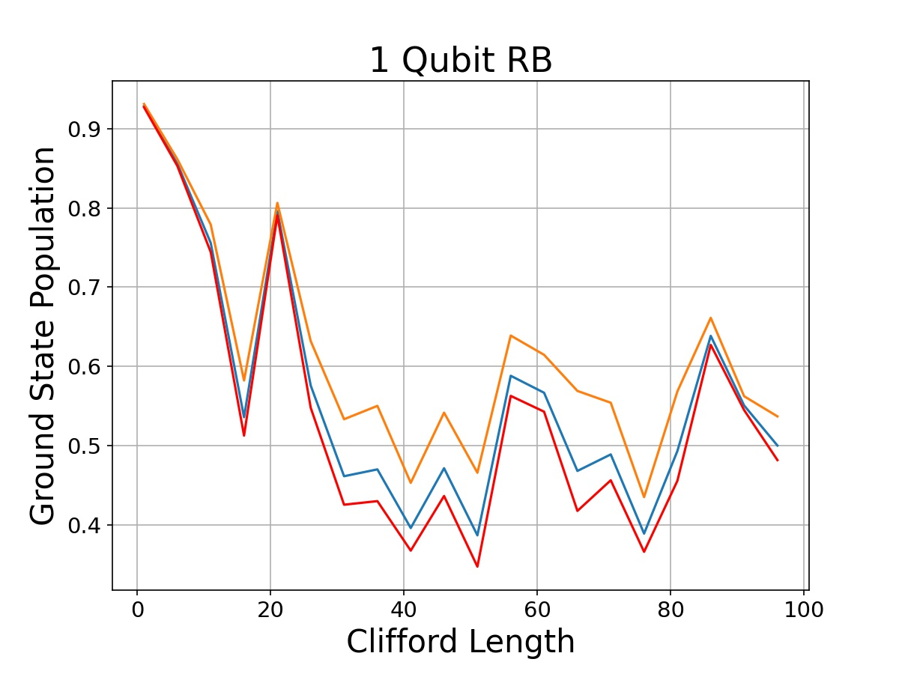

# Generation of stretched single qubit gates for Richardson error extrapolation
## Abstract
With QiskitPulse we can create custom quantum gates that is not provided by a backend. One of easy and practical examples is single qubit gates. In this project, we generate u1, u2, u3 gates with different stretch factor using QiskitPulse and run randomized benchmarking algorithm to estimate systematic error.

## Description
In IBM Quantum backends u1, u2, u3, id, cx gates are provided as basis gates and any quantum circuit can be decomposed into this set. Two main sources of the error of those quantum gates are incoherent error due to limited T1 and T2 times and imperfection of pulse calibration.

Given T1 and T2 are time invariant, you can eliminate this noise with Richardson error extrapolation [1]:

Here we calibrate underlying quantum gates with different stretch factor c_i. In the case of circuit composed of single qubit gates, you need to calibrate u1, u2, u3 gates. Because these gates are generated from x90 or y90 pulse with virtual z rotation (pre-processing of pulse envelope), you just need to calibrate x90 and y90 pulses.

This is partially demonstrated by the joint work of U Chicago with IBM by using QiskitPulse [2]. In this paper they rescaled pulse amplitude with respect to the target rotation angle, but here we need to rescale both pulse duration and amplitude while the rotation angle remain unchanged, i.e. keeping the area under curve of your pulse envelope for different stretch factors.

### Workflow

Finally, we ran a single qubit randomized benchmarking algorithm with stretched x90 and y90 pulses. Below is our workflow.
1. Check the linearity

    We run the rabi oscillation for each pulses amplitude and fitting the data to get the rabi frequencies for each amplitude. After that, we can check the qubit dynamics is linear in the regime we did the experiments.
    * running the rabi oscillation on IBMQ_Bogota quantum computer
    
    
    * fitting the data and get the rabi frequency for each pulse amplitude.
    
    
    The result is linear in the region that pulse amplitude between 0.3 and 1. Since the qubit dynamics is linear in this regime, we can easily modify the duration and the pulse to keep the pulse area.
2. Modify the instruction schedule map

    There's a look up table in device backend that qiskit transpile the quantum into microwave pulses implement in superconductor quantum computer through the mapping in this table. We change the mapping in the table so we can running the same quantum circuit in different stretch factor of pulse duration.
    * Example pulses for u2 gate, and u3 gate in the ibmq_bogota device, respectively.
    
    
    
3. Randomized Benchmarking on different stretch factors
    We ran the RB for some different stretch factor c_i and used Richardson error extrapolation to calculate the noise free result.
    
    
    The yellow line in the figure has stretch factor 1 (the origin result without changing). stretch factor is 2 for blue line. The red line is calculate by the extrapolation. It seems a little strange and we are still looking for the reason.

## Reference:
[1] [Error mitigation extends the computational reach of a noisy quantum processor](https://www.nature.com/articles/s41586-019-1040-7)

[2] [Optimized Quantum Compilation for Near-Term Algorithms with OpenPulse](https://arxiv.org/abs/2004.11205)

## Members
@supergravity
@itsuka021
@xiaotai-yang
@HuberyMing
Qiskit Coach: @nkanazawa1989 - Slack @Naoki Kanazawa emal knzwnao@jp.ibm.com
